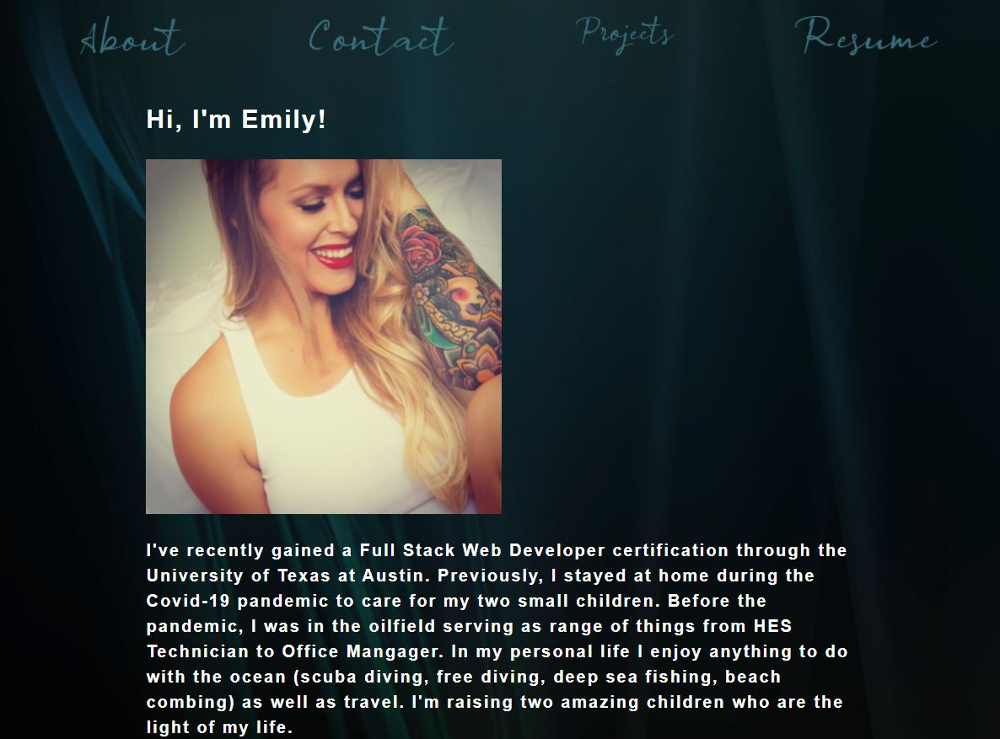

# React Portfolio

## Description
This portfolio displays my always-continuing skillset I've gained thusfar from the UT Austin Bootcamp.

## Table Of Contents
* [Usage](#usage)
* [Contributions](#contributions)
* [Questions](#questions)

## Usage
To use this application simply visit the deployed site and navigate through the site using the links provided at the top of the page. You can access the deployed site [here]().

## Contributions
This project was created by Emily Salinas.

## Questions
Should you have any further questions regarding this application please feel free to reach out to me via [GitHub](https://github.com/Emilyrh1058) or [email](mailto:emilyrh1058@gmail.com).

## Profile Screenshot

